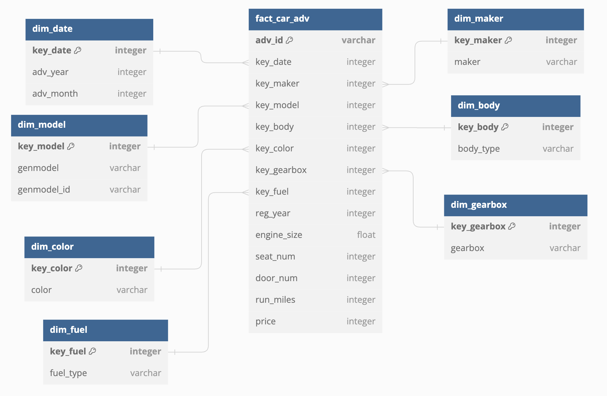

# Capstone Project
## Module 3 - Data Storing

### DWH structure

Let's assume this dwh is build for the purpose of analytics. 
It will often be queried to analyze current market state. 
That's why I will go for start schema, where queries are easier to write and run faster. 

### Facts and Dimensions

### Database creation

[Link to the DB schema creation script](./sql/create_schema.sql)

### ETL

[Link to ETL script](./scripts/load_data.py)

Steps taken:
- Extract data from the source file.
- Filter the extracted data for each dimension 
and then load it into respective dimension tables.
- Create a merged DataFrame 
by adding foreign keys from dimension tables to the original data.
- Load the merged DataFrame into the fact table.
